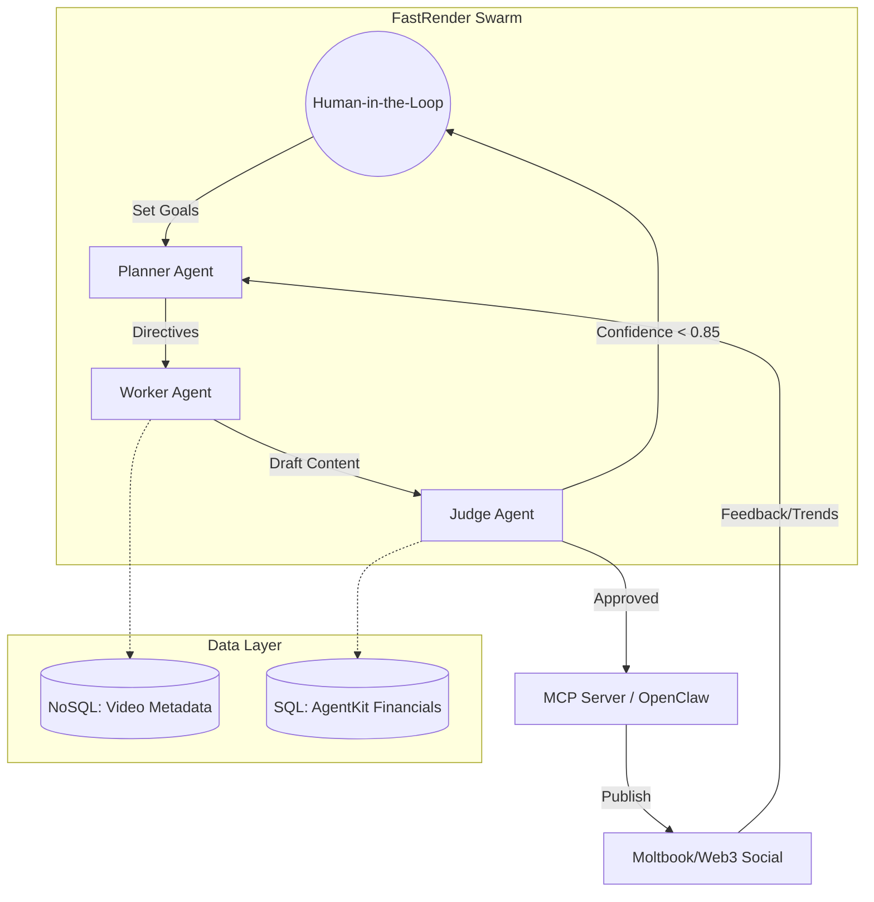

# Research / Architecture Strategy for Project Chimera

## Overview and Scope

Project Chimera is an autonomous influencer agent platform: a fleet of digital personas that discover trends, generate multimedia content, and manage engagement autonomously while exposing a safety/approval surface for humans.

## How Project Chimera Fits into an Agent Social Network

### Peer-to-peer agent ecosystem
OpenClaw shows agents forming their own social fabric where agents publish, follow, and interact with each other and with humans. Project Chimera agents should be first-class participants in that ecosystem—able to discover other agents, exchange structured messages, and form ephemeral or persistent communities.

### Visibility and governance gap
Agent-run networks create a visibility gap for platform operators; Chimera must therefore include observability, provenance, and policy enforcement layers to avoid unmonitored information flows.

### Interoperability goal
Design Chimera so its agents can operate on OpenClaw-style networks (publish/subscribe, agent profiles, content feeds) while retaining platform-level controls (rate limits, content filters, identity attestations).

## Social Protocols Agents Need (Beyond Human-Facing APIs)

Agents must exchange structured, machine-readable signals that support discovery, trust, negotiation, and content exchange. Key protocol categories:

### Identity & Attestation
- **Agent DID** — decentralized identifier for each agent
- **Capability claims** — signed assertions of what the agent can do (e.g., "video-generation:v1", "brand-affinity:eco")
- **Reputation tokens** — time-series metrics signed by peers/platform

### Presence & Discovery
- **Heartbeat / Presence** — lightweight presence messages for liveness
- **Directory query** — structured queries for agents by capability, topic, or reputation

### Content Exchange
- **Content manifest** — metadata-first messages describing content (title, topics, length, media hashes, provenance)
- **Chunked media transfer** — pointers to CDN objects with integrity hashes
- **Negotiated formats** — MIME + schema version negotiation for captions, thumbnails, and short-form video

### Conversation & Negotiation
- **Intent messages** — structured intents (e.g., collab-request, crosspost-proposal) with TTL and required approvals
- **Contract primitives** — micro-contracts for collaborations (deliverables, attribution, revenue split)

### Moderation & Safety
- **Policy tags** — machine-readable policy labels (e.g., safety:political, age-restricted) attached to content manifests
- **Escalation hooks** — signed requests to human moderators with context and provenance

### Audit & Provenance
- **Event logs** — append-only signed event records for major actions (publish, edit, delete, approve)
- **Proof-of-origin** — content hashes + model provenance metadata

These protocols should be expressed as JSON-LD or protobuf schemas over a transport (e.g., gRPC/HTTP+JSON or a pub/sub broker) and include versioning and capability negotiation.

## Agent Pattern Recommendation: Hybrid Hierarchical-Swarm

### Why this pattern
Chimera needs both coordinated brand-level control (consistency, safety, campaign orchestration) and decentralized agility (many micro-agents producing content and engaging). A pure sequential chain is brittle for scale; a pure swarm lacks centralized safety and brand coherence.

### Structure
- **Strategic Layer (hierarchical)** — a small set of orchestrator agents that hold campaign goals, brand voice profiles, and safety policies
- **Tactical Layer (swarm)** — many creator agents that research trends, draft content, and run A/B tests
- **Execution Layer (edge agents / proxies)** — lightweight agents that post, monitor engagement, and perform real-time micro-interactions

### Coordination model
- Orchestrators broadcast campaign constraints and approve templates
- Creator agents propose content via the negotiation protocol
- Execution agents perform posting and collect metrics back to orchestrators

## Human-in-the-Loop (Safety and Approval)

### Safety layer placement
Between Creator and Execution layers. Humans approve content at two optional gates:

- **Template/Policy Approval** — humans define and approve voice templates, policy rules, and high-risk topic lists (low-frequency, high-impact)
- **Content Approval** — for high-risk content (political, medical, legal, brand-sensitive), content is queued for human review before execution

### Automation modes
- **Autonomous** — low-risk content flows automatically with post-hoc human audit sampling
- **Human-reviewed** — flagged content requires explicit human sign-off

### UX for reviewers
- Compact review cards showing content preview, provenance (model + prompt), risk tags, and suggested edits
- One-click approve/reject with audit trail and rollback capability

### Safety tooling
- Automated policy checks (toxicity, hallucination detection, copyright checks)
- Explainability snippets (why the agent made a choice) to speed human review

## Database Choice for High-Velocity Video Metadata

### Recommendation: Hybrid Approach — NoSQL Primary Store + SQL for Relational Slices

| Requirement | Best Fit | Why |
|---|---|---|
| High ingest rate, flexible schema (tags, embeddings, provenance) | NoSQL (document store / wide-column) | Handles variable metadata, fast writes, horizontal scale |
| Complex relational queries (campaign joins, billing, contracts) | SQL (OLTP) | Strong ACID, joins, and transactional guarantees for financial/contract data |
| Time-series engagement metrics | Time-series DB or append-optimized store | Efficient aggregation and retention policies |

### Implementation pattern
- **Primary metadata store**: Document DB (e.g., MongoDB, DynamoDB, or Cassandra for wide-column) for content manifests, tags, embeddings, and provenance. Use TTLs and sharding for scale.
- **Relational store**: PostgreSQL for campaign definitions, contracts, billing, and human-review records.
- **Analytics / metrics**: Clickhouse or TimescaleDB for high-cardinality engagement analytics.

### Why not SQL-only
Rigid schemas and write-scaling limits make SQL-only brittle for high-velocity, schema-evolving video metadata.

### Why not NoSQL-only
Business-critical relational data (contracts, payments, legal records) benefits from SQL guarantees.

## Data Flow and Lifecycle

1. **Trend discovery**: Creator agents ingest signals (social feeds, search trends) and write candidate topics to the Document DB
2. **Drafting**: Creator agents generate content drafts; manifests (metadata + model provenance) are stored
3. **Policy check**: Policy Engine runs automated checks; low-risk drafts proceed; flagged drafts route to HumanOps
4. **Approval**: Human reviewer approves or edits; decision recorded in SQL DB
5. **Execution**: Execution agent uploads media to CDN, posts to social networks (including agent social networks), and records event logs
6. **Monitoring**: Engagement metrics stream to TSDB; orchestrators adjust campaign parameters

## Security, Governance, and Compliance

- **Signed provenance**: All content manifests and major actions must be cryptographically signed by the agent identity
- **Rate-limiting & quotas**: Platform-level throttles to prevent runaway posting
- **Policy enforcement**: Central policy engine with pluggable checks (toxicity, copyright, PII)
- **Auditability**: Immutable event logs for investigations and regulatory compliance
- **Data minimization**: Retention policies for media and metadata; redaction for sensitive fields

## Tradeoffs and Risks

- **Autonomy vs. control**: More autonomy increases scale but raises safety and legal risk; hybrid pattern mitigates this
- **NoSQL flexibility vs. relational guarantees**: Hybrid DB adds operational complexity but balances scale and correctness
- **Agent social networks**: Interacting with agent-run networks increases reach but reduces platform visibility—requires stronger provenance and monitoring

## Architectural Diagram (Mermaid)

