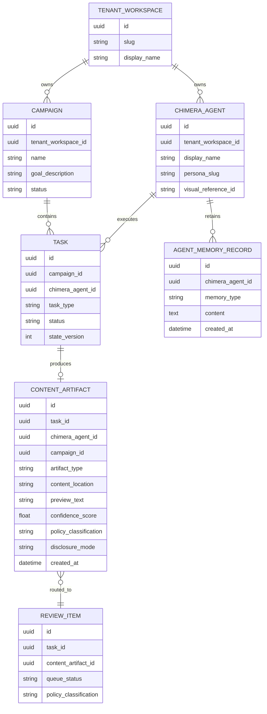

# Project Chimera Technical Spec

## Architecture Overview

Project Chimera is a contract-first web platform with a Spring Boot 4.x backend and a React JS + Vite frontend. The backend follows layered modules for controller, service, domain, and persistence concerns. The orchestration model follows the FastRender pattern, with Planner, Worker, and Judge responsibilities represented first as internal orchestration services and later evolvable into distributed workloads.

## Runtime and Infrastructure

- Backend runtime: Java 25, Spring Boot 4.x, Maven.
- Frontend runtime: React JS, Vite, TypeScript-based client code.
- Deployment model: containerized workloads orchestrated on Kubernetes in a hybrid AWS/GCP environment.
- Autoscaling target: support burst workloads during viral or high-activity events.
- Persistence split:
  - PostgreSQL for transactional control-plane data.
  - MongoDB for flexible memory, content metadata, and provenance-oriented documents.
  - Redis for ephemeral coordination, queueing, and short-lived context.

## API Contracts

The authoritative control-plane API contract lives in `specs/001-autonomous-influencer-network/contracts/chimera-control-plane.openapi.yaml`.

### Required API Domains

- Authentication
  - Local login
  - Current session lookup
- Agents
  - Create agent
  - List agents
  - Get agent details
- Campaigns
  - Create campaign
  - List campaigns
  - Retrieve current execution plan
  - Approve execution plan
- Review
  - List pending review items
  - Submit review decisions
- Wallets
  - Retrieve agent wallet
  - Create transaction request
- Signals
  - Ingest external signal

### JSON Contract Principles

- All endpoints must use explicit request and response DTOs.
- Persistence entities must not be exposed directly.
- Tenant scoping must be enforced server-side, not inferred from the client.
- Confidence score, policy classification, and audit correlation data must remain available to control-plane flows.

### Representative JSON Inputs/Outputs

#### Create Agent Request

```json
{
  "displayName": "Aster Nova",
  "personaSlug": "eco-fashion-genz",
  "immutablePersona": {
    "tone": "witty",
    "values": ["sustainability", "transparency"],
    "hardRules": ["never give legal advice", "always disclose AI identity when asked"]
  },
  "visualReferenceId": "ref_01HXYZ"
}
```

#### Agent Response

```json
{
  "id": "5c6f5dd3-2a8b-45cf-9d7b-2de6db4cf58b",
  "tenantWorkspaceId": "15dc7d3d-c0fd-4d7f-8584-c0d7331a0319",
  "displayName": "Aster Nova",
  "personaSlug": "eco-fashion-genz",
  "status": "active",
  "mutableBiographySummary": "Launch-ready sustainable streetwear creator persona",
  "visualReferenceId": "ref_01HXYZ"
}
```

#### Review Decision Request

```json
{
  "decisionType": "approve",
  "rationale": "Brand-safe and within confidence policy"
}
```

#### Transaction Request Input

```json
{
  "direction": "outbound",
  "amount": "125.00",
  "assetCode": "USDC",
  "counterparty": "0x8a31...c91b",
  "rationale": "Approved collaborator payment"
}
```

## Database Schema

The detailed entity definitions live in `specs/001-autonomous-influencer-network/data-model.md`. The core relational and document-oriented data model includes tenants, users, campaigns, execution plans, tasks, review items, decisions, wallets, transactions, external signals, content artifacts, and audit events.

### ERD for Video Metadata and Related Content Storage



### Video Metadata Requirements

For `CONTENT_ARTIFACT` records where `artifact_type = video`, the stored metadata must support:

- tenant and agent ownership
- campaign and task lineage
- preview text or caption summary
- content location or asset pointer
- confidence score and policy classification
- disclosure mode
- provenance-ready extension fields such as media hash, duration, thumbnail pointer, generation model, and style or character reference identifiers

These video-specific metadata fields can evolve in MongoDB as flexible document extensions while preserving relational lineage in the control-plane model.

## Connector Boundary

The external platform boundary is defined in `specs/001-autonomous-influencer-network/contracts/platform-connector-contract.md`.

Required connector operations:

- `publishContent`
- `replyToInteraction`
- `fetchSignals`
- `fetchPublishingStatus`
- `validateRateLimit`

## Implementation Constraints

- Public APIs must be documented with OpenAPI.
- Controllers must remain thin and delegate business rules to services.
- Frontend API access must stay behind dedicated client modules.
- React state must remain feature-local unless cross-feature coordination proves a global store is necessary.
- All sensitive, privileged, or financial actions must emit immutable audit events.